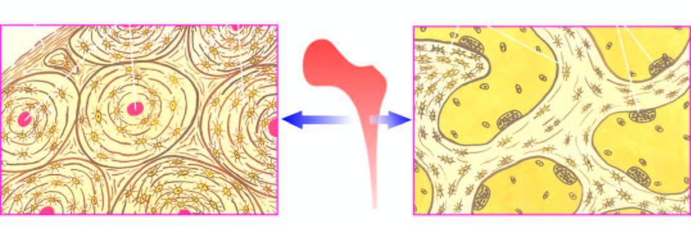
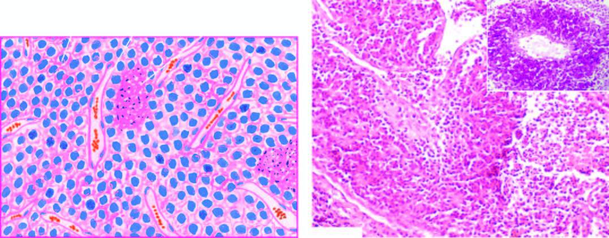

# Visual_question_answering_project

The proposed method is a simple model that combines the strong feature map encoders from pretrained CLIP. In this method, we have in parallel two inputs: the question and the image. Each one of them is fed into the corresponding CLIP encoder. After that, we obtain embeddings of the two inputs. Subsequently, we apply different strategies to join these two embedding vectors—concatenation or summation. Depending on the strategy chosen, we pass the output of that operation to an MLP, which will generate a probability distribution regarding whether the answer is yes or no. Therefore, our model fine-tunes pretrained CLIP embeddings in the closed-ended medical VQA task.


## Prerequisites

Python: 3.10.9

Please install dependence package by run following command:

```
pip install -r requirements.txt
```

To install CLIP follow the next instructions:

```
conda install pytorch==2.1.0 torchvision==0.16.0 torchaudio==2.1.0 pytorch-cuda=12.1 -c pytorch -c nvidia
pip install git+https://github.com/openai/CLIP.git
```

## Dataset

The test image dataset is in the next path in BCV002:
```
/home/nandradev/ProyectoAML/Metodo/ProyectoAML/test
```
The other sets of the datasets are not required due to the code is made to do it by itself. It loads the dataset directly with Huggingface, instead of having folders with it. 

To access an image you have to use the following format "number.jpg" where the number corresponds to the name of the image. Numbers in the test folder range from 0 to 3361.

## Model weights

The best model (final method) weights are in the following path in BCV002:
```
/home/nandradev/ProyectoAML/Metodo/ProyectoAML/CLIP_ViT-B32_concat_nl1_hd1024_BCELoss_w40.pth
```

## Training

You can train the model from 0 using this command. You do not need to download the dataset externally, the code is implemented to do it:
```
python main.py --train True
```

## Test
There are two ways for testing the model. You can train it and then test it with the first command or you can use the weigths we show in the model weigths before. You do not have to specify the root, it is in the main.py.
For testing the model you have trained you can run the following command:
```
python main.py --bestmethod True --mode "test"
```

For testing the model with our weights you run the following command:
```
python main.py --bestmethod True --mode "test" --pretrained True
```
Both should reproduce our final method results reported in the paper. 

## Demo

The demo could be tested by running this command:
```
python main.py --mode 'demo' --img [IMAGE_PATH]
```
You can specify the image, by naming the set and the id of the image, and the demo will need you to input a question. Then the model is going to print the predicted answer. The demo only runs the pretrained best method with the weights in BCV002. We also have the test images of the PathVQA dataset in the following directory (in BCV002):

```
/home/nandradev/ProyectoAML/Metodo/ProyectoAML/test
```
Here are some examples for images and questions. For best results, we recommend using questions that belong to the PathVQA dataset:


### Image 1



```
python main.py --mode 'demo' --img '/home/nandradev/ProyectoAML/Metodo/ProyectoAML/test/6.jpg'
```
Question 1:

```
'does the cortical bone forming the outer shell show concentric lamellae along with osteocytic lacunae surrounding central blood vessels, while the trabecular bone forming the marrow space shows trabeculae with osteoclastic activity at the margins?
```
Output:
```
'The answer is no'
```
Question 2: 
```
'does the trabecular bone forming the marrow space show trabeculae with osteoclastic activity at the margins?'
```
Output: 
```
'The answer is yes'
```

### Image 2



```
python main.py --mode 'demo' --img '/home/nandradev/ProyectoAML/Metodo/ProyectoAML/test/34.jpg'
```
Question 1:

```
'are the lipofuscin pigment granules also included?'
```
Output:
```
'The answer is no'
```
Question 2: 
```
'are areas of necrosis and inflammatory in filtrate also included?'
```
Output: 
```
'The answer is yes'
```


