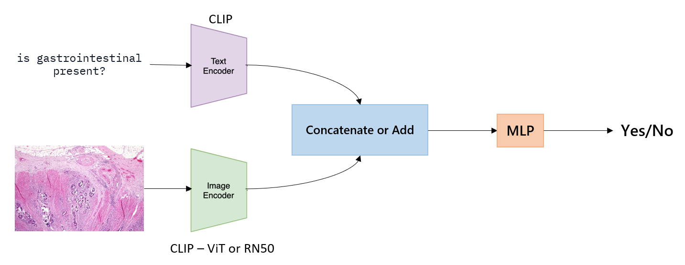

# Visual_question_answering_project

The proposed method is a simple model that combines the strong feature map encoders from pretrained CLIP. In this method, we have in parallel two inputs: the question and the image. Each one of them is fed into the corresponding CLIP encoder. After that, we obtain embeddings of the two inputs. Subsequently, we apply different strategies to join these two embedding vectors—concatenation or summation. Depending on the strategy chosen, we pass the output of that operation to an MLP, which will generate a probability distribution regarding whether the answer is yes or no. Therefore, our model fine-tunes pretrained CLIP embeddings in the closed-ended medical VQA task.



## Prerequisites

Python: 3.10.9

Please install dependence package by run following command:

```
pip install -r requirements.txt
```

To install clip follow the next instructions:

```
conda install pytorch==2.1.0 torchvision==0.16.0 torchaudio==2.1.0 pytorch-cuda=12.1 -c pytorch -c nvidia
pip install ftfy regex tqdm
pip install git+https://github.com/openai/CLIP.git
```

## Dataset

The test dataset is in the next path:
```
/home/nandradev/ProyectoAML/Metodo/ProyectoAML/test
```
To acces to the images you have to declare the image you have to use the following format "number.jpg".

## Model weigths

The best model weigth are in the following path:
```
/home/nandradev/ProyectoAML/Metodo/ProyectoAML/CLIP_ViT-B32_concat_nl1_hd1024_BCELoss_w40.pth
```

## Training

You can train the model from 0 using this command. You do not need to download the dataset external, the code is implemented to do it:
```
CUDA_VISIBLE_DEVICES=0 python main.py --train True
```

## Test

For testing the model you can run the following command:
```
CUDA_VISIBLE_DEVICES=0 python main.py --bestmethod True --mode "test"
```

## Demo

The demo could be tested by running this command:
```
CUDA_VISIBLE_DEVICES=0 python main.py --mode 'demo' --img 'test/0.jpg'
```
You can specify the image, by naming the set and the id of the image, and the demo will need you to input a question. Then the model is going to print a possible answer.
